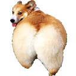

Incroyable du cul
=============

Extension Chrome qui ajoute "du cul" derrière tous les "incroyable".

Vous pouvez installer l'extension [ici](https://chrome.google.com/webstore/detail/incroyable-du-cul/jkhncalbljfjmgiopdnapejgkkdaaklf) 

Inspiré de MisterMV, du "Manu Auto Correct" de Maxime Bouveron et du Bot du Cul de Bilgé Kimyonok.  
Repris depuis l'extension "Cloud to butt" de Steven Frank.

- MisterMV : https://twitch.tv/mistermv
- Manu Auto Correct : https://github.com/Bo-Duke/Manu-Auto-Correct / [Télécharger l'extension Chrome](https://chrome.google.com/webstore/detail/manu-auto-correct/eamgamedjemopbnggghghnciejnbdpoe)
- Bot du Cul : https://github.com/WhiteFangs/BotDuCul / https://twitter.com/BotDuCul
- Clout to butt : https://github.com/panicsteve/cloud-to-butt  
  

Le code est proposé sous licence [WTFPL](https://fr.wikipedia.org/wiki/WTFPL) (cf [license.txt](https://github.com/dut/incroyable-du-cul/blob/master/LICENSE.txt)), vous pouvez donc le modifier à votre sauce, changer de nom, ne plus me citer (sniff), et même m'offrir une bière si vous passez sur Lyon !
